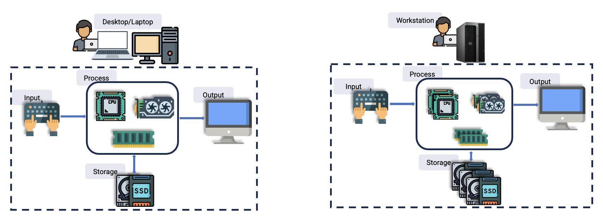
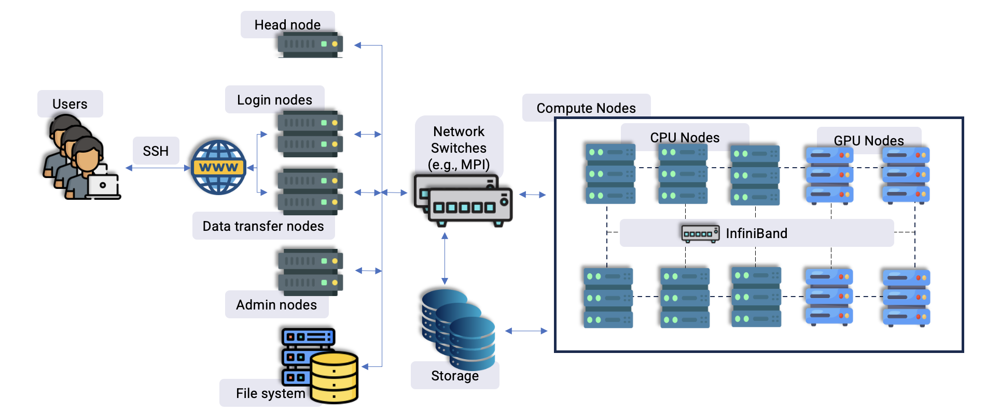
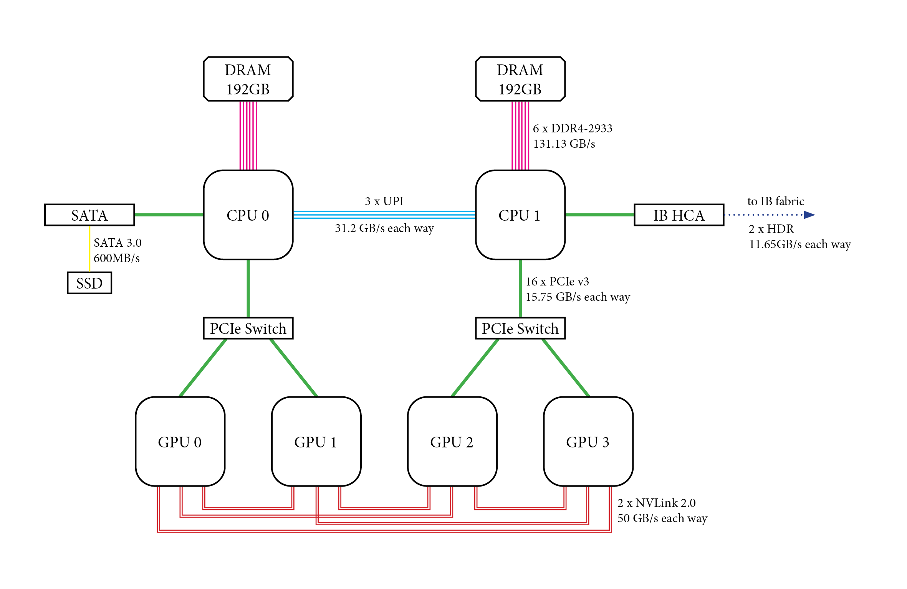

Architecture of an HPC Machine
-------------------------------

.. admonition:: Overview
   :class: Overview

    * **Time:** 15 min

    #. Learn about the architecture of a High-Performance Computing (HPC) machine.
    #. Learn how to find the architecture of a node using the ``lstopo`` command.

.. admonition:: Explanation
   :class: attention

   In computer science, ``architecture`` generally refers to the design and structure of a computer system
   — how its components are organized and how they interact. There are different types of architectures :
    
   * Computer Architecture: Refers to the design of a computer's hardware components.
   * System Architecture: Describes how the entire system (hardware + software) is organized.
   * Software Architecture: Refers to the high-level structure of software systems.
   * Network Architecture: Describes how different network components are organized and how they communicate.

Personal Computer (PC) Architecture
^^^^^^^^^^^^^^^^^^^^^^^^^^^^^^^^^^^^

A laptop or desktop computer can be thought of as a single computing unit

HPC Architecture
^^^^^^^^^^^^^^^^^^^^^^^^^^^^^^^^

Unlike a PC, an HPC machine is composed of multiple interconnected components designed to deliver
significantly higher computational power. It typically consists of numerous nodes, with each node containing
multiple CPUs and its own dedicated memory, and — on some nodes — one or more GPUs. In essence, an HPC
machine functions as a large computing cluster.

.. important::

   A cluster is a group of interconnected computers or servers that work together as a single system to 
   perform tasks more efficiently, reliably, or quickly than a single machine could.

The architecture of an HPC machine typically includes:

* **Head Node**: The primary node that coordinates job scheduling and overall management of the HPC cluster.

* **Login Node**: The node where users log in to submit and manage their jobs, typically providing an interface for interaction with the cluster.

* **Data Transfer Node**: A node optimized for handling data transfers between the HPC cluster and external storage or networks, improving data throughput.

* **Admin Node**: A node dedicated to system administration tasks, such as monitoring system health and managing configurations.

* **File Systems**: The infrastructure that manages data storage and retrieval within the HPC cluster, crucial for efficient access to large datasets.

* **Storage**: The hardware or system responsible for storing data, including high-capacity solutions like Network Attached Storage (NAS) or Storage Area Network (SAN).

* **Compute Node**: The nodes where actual computational tasks are executed, performing the calculations and processing required for applications.

* **Network Switches**: Devices that route data between different nodes in the HPC cluster, ensuring efficient communication and data transfer.

Architecture of a Node
^^^^^^^^^^^^^^^^^^^^^^^^^^^^^^^^

A node contains sockets, cores, caches and memory arranged in a particular topology. A GPU node adds one or
more GPUs, each attached to a specific part of that topology:

You can inspect the topology of a node on Gadi with ``lstopo``. Ask for console output explicitly —
plain ``lstopo`` tries to open a graphical window, which will fail in a normal SSH session:

.. code-block:: bash
   :linenos:

   lstopo --of console

``lstopo-no-graphics`` is an equivalent, text-only version of the same tool.

If you want to save the output as an image instead, use ``--of`` to specify the format:

.. code-block:: bash
   :linenos:

   lstopo --of png topology.png

.. warning::

   ``lstopo`` reports the topology of **the node you run it on**. Run it after logging in and you are
   describing a *login* node, not a compute node — and the two are not the same hardware. To inspect a
   compute node you need to run ``lstopo`` inside a job. Interactive jobs are covered in Session 2.

.. admonition:: Key Points
   :class: hint

   * Each node in an HPC system can have multiple CPUs and independent memory; some nodes also have GPUs.
   * The architecture of an HPC machine includes various components such as head nodes, login nodes, compute nodes, and storage systems.
   * ``lstopo`` is a command-line tool that reports the hardware topology of a system.
   * It shows the arrangement of CPUs, memory, and other components in a node.
   * It describes the node it runs on, so run it on a compute node to learn about compute nodes.