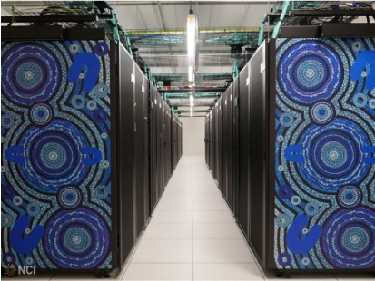

What is High-Performance Computing (HPC)?
--------------------------------------------

.. admonition:: Overview
   :class: Overview

    * **Time:** 10 min

    #. Understand what High-Performance Computing (HPC) is.
    #. Learn when to use HPC.

High-Performance Computing (HPC) refers to the use of supercomputers and parallel processing techniques to
solve complex computational problems at high speeds. HPC systems are designed to perform large-scale
computations that require significant processing power, memory, and storage capabilities.
They are used in various fields such as scientific research, engineering simulations, financial modeling,
and data analysis.

A laptop or desktop computer typically has limited processing power and memory
compared to HPC systems. For example, a high-end laptop might have

* 16 GB of RAM
* 8-core CPU
* GPU with 4 GB of memory

In contrast, an HPC system is much more powerful. For instance, a standard compute node on Gadi, the
supercomputer at the National Computational Infrastructure (NCI) in Australia, has:

* 48 cores per node (two 24-core Intel Xeon Cascade Lake CPUs)
* 192 GB of RAM per node

Most of Gadi's nodes are standard compute nodes like this and have **no GPU**. A smaller number of
dedicated GPU nodes are also available, and these have:

* 48 cores per node
* 384 GB of RAM per node
* Four NVIDIA V100 GPUs per node, each with 32 GB of memory

.. admonition:: Explanation
   :class: attention

    **Node** refers to a single computing unit within an HPC system. Each node can have multiple CPUs
    and independent memory, and some nodes also have GPUs.

    A **cluster** is a group of interconnected nodes that work together as a single system.
    Each node typically has its own CPU, memory, storage, and possibly GPU resources. The nodes are connected
    through a high-speed network, and they coordinate to run tasks in parallel.

    An HPC system is a very powerful cluster.

Moreover, there are many nodes in the system, which can work together to perform computations in parallel.
This allows HPC systems to handle large datasets and perform complex calculations much faster than a typical
laptop or desktop computer.

When to Use HPC?
^^^^^^^^^^^^^^^^^^^^^^^^^^^^^^^^

HPC is used when the computational requirements of a task exceed the capabilities of standard computing systems.

* When you are dealing with large datasets that do not fit into the memory of a single machine.
* When your application/program is computationally intensive and requires significant processing power.
* When your application is time-sensitive and requires fast execution.

.. admonition:: Key Points
   :class: hint

   * HPC systems are designed to perform large-scale computations that require significant processing
     power, memory, and storage capabilities.
   * HPC is used when the computational requirements of a task exceed the capabilities of standard computing systems.
   * A node is a single computing unit in the system; a cluster is many nodes working together.
   * Not every node in an HPC system has a GPU.
