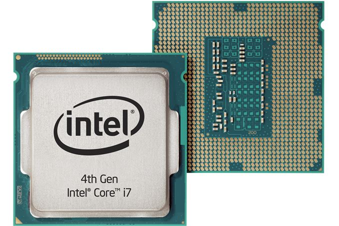
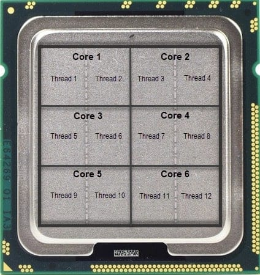
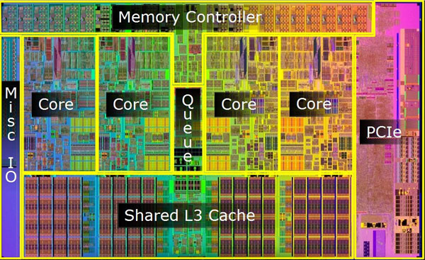
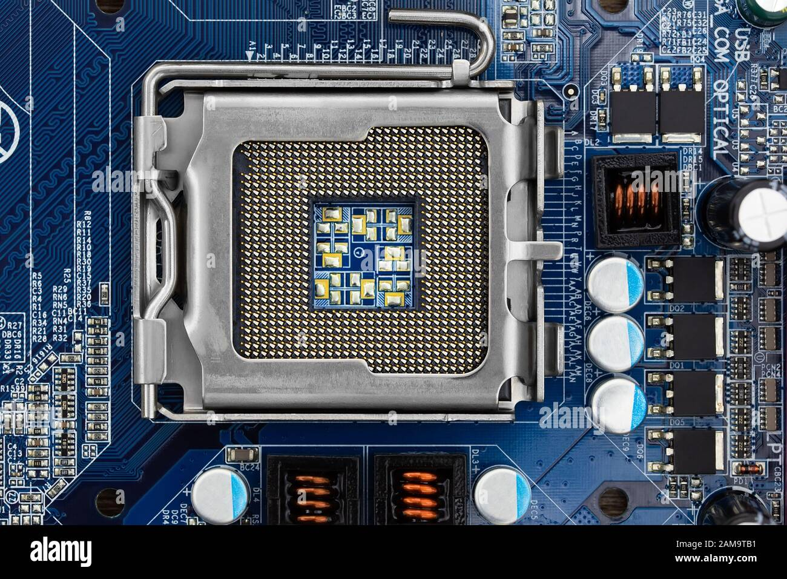

Common CPU Terminology
-----------------------------------

.. admonition:: Overview
   :class: Overview

    * **Time:** 10 min

    #. Understand common CPU terminologies.
    #. Learn about CPU, cores, hardware threads, and CPU die.

    
This section introduces some common terminologies with respect to CPU.

CPU (Central Processing Unit)
^^^^^^^^^^^^^^^^^^^^^^^^^^^^^^^^

* The **main processor** of a computer.
* Responsible for executing instructions (code).
* Can contain **multiple cores** inside a single chip or package.
* Often referred to as a **processor**.
* *Which* instructions a CPU can execute is defined by its **instruction set architecture (ISA)** —
  every CPU is built to implement one. Gadi and virtually all Intel and AMD server CPUs implement
  **x86_64** (also written *x86-64* or *AMD64*); ``uname -m`` reports it. Different CPUs sharing an ISA
  can run the same binary, but that binary will not run on a CPU implementing a different ISA, such as
  ``aarch64`` (64-bit ARM).

**Example:**  
A computer might have **1 CPU** with **8 cores**.

Core
^^^^^^^^^^^^^^^^^^^^^^^^^^^^^^^^

* A **processing unit** inside a CPU.
* Each core can independently execute tasks.
* Modern CPUs typically have **multiple cores** to allow parallel processing (multitasking or multi-threaded applications).

**Example:**
An Intel Core i7 CPU might have **6 cores**, so it can run 6 tasks at the same time on separate hardware.

Hardware Thread (SMT / Hyper-Threading)
^^^^^^^^^^^^^^^^^^^^^^^^^^^^^^^^^^^^^^^

* A **hardware thread** is a stream of execution that a core can run.
* With **SMT** (Simultaneous Multi-Threading, called **Hyper-Threading** on Intel), one physical core
  presents **two or more** hardware threads to the operating system. The threads share the core's
  execution units, so they are not equivalent to two separate cores.
* This is why a tool such as ``lstopo`` or ``htop`` may report twice as many "CPUs" as the machine has
  physical cores.

**Example:**
A 6-core i7 with Hyper-Threading enabled has **6 physical cores** but reports **12 hardware threads**.

.. note::

   On Gadi, a standard compute node has **48 physical cores**, and the PBS ``ncpus`` resource you
   request counts these physical cores. When you size a job, count cores — not hardware threads.

CPU Die
^^^^^^^^^^^^^^^^^^^^^^^^^^^^^^^^

* The **physical piece of silicon** that contains the circuitry of one or more cores.
* Dies are manufactured on silicon wafers and later packaged into CPUs.
* A single die can hold multiple cores, caches, and other components.
* Some CPUs (like AMD’s multi-chip modules) may contain **multiple dies** inside one package.

From Logic Gates to a Die
~~~~~~~~~~~~~~~~~~~~~~~~~

A die is simply what you get when a very large number of **logic gates** are etched onto one piece of
silicon. The hierarchy runs:

* **Transistors** — microscopic switches patterned into the silicon.
* **Logic gates** (AND, OR, NOT, XOR, ...) — a handful of transistors wired together to compute one
  Boolean operation.
* **Functional blocks** — millions of gates combined into adders, multipliers, registers, cache arrays,
  and control logic.
* **Core** — a complete set of those blocks, capable of fetching and executing instructions.
* **Die** — the single slab of silicon carrying one or more cores plus shared caches and interconnect.

So when a vendor quotes a transistor count or a process node (e.g. 7 nm), they are describing how many
gates fit on the die and how small each one is. Smaller gates mean more of them per die, shorter signal
distances, and lower energy per switch — which is what makes higher core counts and clock speeds
possible in each new generation.

.. note::

   Logic gates are the level at which the hardware stops being "electronics" and starts being
   *computation*: everything your code does eventually reduces to Boolean operations performed by gates
   on a die.

If you would like to follow this hierarchy all the way up for yourself, the book
`The Elements of Computing Systems <https://www.nand2tetris.org>`_ by Noam Nisan and Shimon Schocken —
widely known as **Nand to Tetris** — builds a complete working computer starting from a single NAND
gate, going through logic gates, an ALU, a CPU, an assembler, a compiler, and finally an operating
system to play the Tetris game. It is a great way to play Tetris. 

NUMA (Non-Uniform Memory Access)
^^^^^^^^^^^^^^^^^^^^^^^^^^^^^^^^

**NUMA** is a memory architecture in which memory is divided into regions, each attached to a particular
group of cores, so that memory access time depends on *which* cores are doing the accessing.

* Each group of cores has its own **local memory**.
* Access to local memory is **faster** than access to memory attached to another group (remote memory).
* The group of cores plus its local memory is called a **NUMA node**.
* Placing a process close to the memory it uses is therefore a real performance concern on HPC systems.
* On Gadi, if you request cores less than the number of cores of a single node, even if you request the number of cores equal to the number of cores of a NUMA node. The job does not guarantee that the cores assigned to your job are from the same NUMA node. You need to request the entire node to have that control.

CPU (Socket)
~~~~~~~~~~~~

   

* A **socket** is the physical connector on the motherboard that holds one CPU package.
* A multi-socket machine therefore has more than one CPU, and each socket has memory attached to it.
* A socket maps to **at least one** NUMA node, but not always exactly one: modern CPUs can subdivide a
  single socket into several NUMA nodes (AMD's NPS setting, Intel's Sub-NUMA Clustering).
* On Gadi, the minimum number of cores under one node is any number of cores available on that node. However, you won't get control what cores are assigned to your job. For more than one node, the number of cores you request must be multitudes of cores on a single node. For example, this is multitudes of **48 cores** on a **normal** queue (Intel Cascade Lake) and multitudes of **104 cores** on a **normalsr** queue (Intel Sapphire Rapids). 

.. tip::

   Do not assume *sockets == NUMA nodes*. Check the machine you are actually running on — ``lstopo``
   reports both, and you will see this in the next section.

.. admonition:: Key Points
   :class: hint

   * A CPU is the main processor of a computer, often with multiple cores.
   * A core is a processing unit within a CPU that can execute tasks independently.
   * A hardware thread is a stream of execution within a core; with SMT a core can present more than one.
   * A CPU die is the physical silicon piece containing the cores and circuitry.
   * A die is built from billions of transistors wired into logic gates, which combine into the
     functional blocks that make up a core.
   * NUMA is a memory architecture that allows each CPU to have its own local memory, improving performance in multi-CPU systems.
   * A socket usually maps to at least one NUMA node, but a single socket can expose several.

